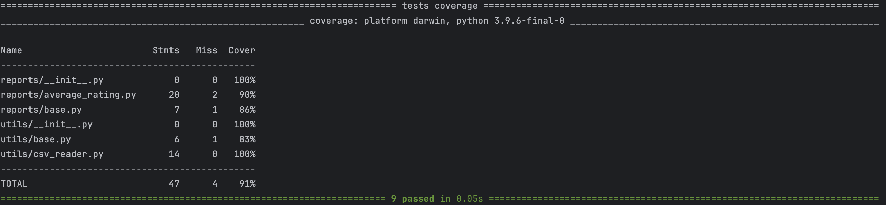
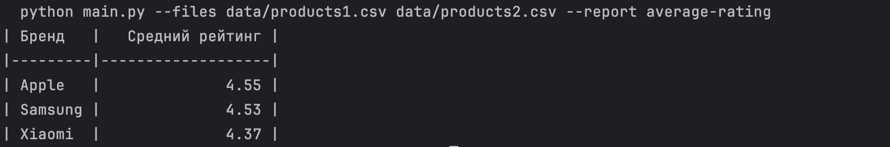

## Воспроизвести окружение
```bash
pip install -r requirements.txt
```
## Запустить программу
```bash
python main.py --files data/products1.csv data/products2.csv --report average-rating
```
## Запустить тесты
```bash
pytest --cov=reports --cov=utils
```
## Примеры запуска
Покрытие тестами 91 процент


Программа успешно отработала с выводом


## Архитектура
Чтобы добавить новый отчет, реализуем класс в reports, который наследует базовый класс base

Чтобы реализовать чтение нового формата (помимо csv), реализуем класс в utils, который наследует базовый класс base